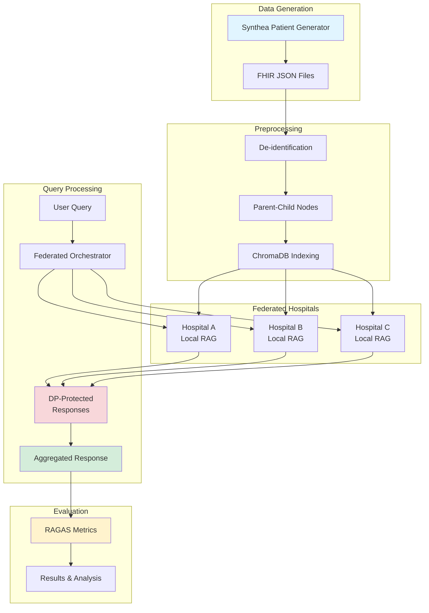

# FRAG-MED: Federated Retrieval-Augmented Generation for Medical Diagnosis

<div align="center">

**A privacy-preserving, federated RAG system for collaborative medical diagnosis across multiple healthcare institutions without centralizing sensitive patient data.**

[](https://www.python.org/downloads/)
[](https://opensource.org/licenses/MIT)
[](http://makeapullrequest.com)

</div>

---

## 📑 Table of Contents

- [Overview](#-overview)
- [Key Features](#-key-features)
- [System Architecture](#-system-architecture)
- [Prerequisites](#-prerequisites)
- [Installation](#-installation)
- [Complete Workflow](#-complete-workflow)
  - [1. Generating Patient Data (Synthea)](#1-generating-patient-data-synthea)
  - [2. Preprocessing Pipeline](#2-preprocessing-pipeline)
  - [3. Running the RAG System](#3-running-the-rag-system)
  - [4. Federated Deployment](#4-federated-deployment)
  - [5. Evaluation & Metrics](#5-evaluation--metrics)
- [Configuration](#-configuration)
- [Usage Examples](#-usage-examples)
- [Evaluation & Benchmarking](#-evaluation--benchmarking)
- [Privacy & Security](#-privacy--security)
- [Troubleshooting](#-troubleshooting)
- [Project Structure](#-project-structure)
- [Performance](#-performance)
- [Contributing](#-contributing)
- [Citation](#-citation)
- [License](#-license)

---

## 🎯 Overview

FRAG-MED addresses a critical challenge in healthcare AI: **enabling collaborative diagnosis across hospitals while maintaining strict data privacy**. By combining **Retrieval-Augmented Generation (RAG)**, **Federated Learning**, and **Differential Privacy**, this system allows multiple healthcare institutions to benefit from collective knowledge without sharing raw patient data.

### Problem Statement

Healthcare institutions face a dilemma:
- **Isolated data silos** limit AI model effectiveness
- **Privacy regulations** (HIPAA, GDPR) prevent data centralization
- **Collaborative diagnosis** could improve patient outcomes

### Our Solution

FRAG-MED enables:
- ✅ Each hospital maintains **complete data sovereignty**
- ✅ **Privacy-preserving** queries across federated hospitals
- ✅ **Differential privacy** (DP) and **k-anonymity** guarantees
- ✅ **Medical-specific models** (BioMistral-7B + PubMedBERT)
- ✅ **Real-time observability** with Arize Phoenix
- ✅ **Comprehensive evaluation** using RAGAS metrics

---

## 🌟 Key Features

### Privacy & Security
- 🔒 **Differential Privacy**: Configurable ε-DP for embedding noise
- 🔒 **K-Anonymity**: Ensures minimum k patients per result
- 🔒 **De-identification**: Comprehensive PII removal (names, dates, addresses, MRNs)
- 🔒 **Local-only models**: No external API calls, complete data sovereignty

### Medical AI
- 🧠 **BioMistral-7B**: Medical-domain LLM via Ollama
- 🧬 **PubMedBERT**: Clinical text embeddings (768-dim)
- 📊 **Parent-Child Architecture**: Context-rich retrieval with token efficiency
- 🔍 **Semantic Search**: ChromaDB vector database

### Federated Architecture
- 🏥 **Multi-hospital support**: 10 federated hospitals (A-J)
- ⚖️ **Intelligent aggregation**: Score-based response merging
- 🎯 **Privacy-utility tradeoff**: Configurable epsilon values
- 📡 **Decentralized**: Each hospital runs independent RAG

### Evaluation & Observability
- 📈 **RAGAS Metrics**: Faithfulness, relevance, precision, recall, correctness
- 🔬 **Standard Benchmarks**: PubMedQA, MedQA, MMLU Medical
- 👁️ **Arize Phoenix**: Real-time tracing and monitoring
- 📊 **Privacy-utility analysis**: Multi-epsilon evaluation

---

## 🏗️ System Architecture

### High-Level Design



### Component Stack

```
┌─────────────────────────────────────────────────────────────┐
│                    Application Layer                        │
│  ┌────────────┐  ┌──────────────┐  ┌──────────────┐        │
│  │ Streamlit  │  │  Custom CLI  │  │  Evaluation  │        │
│  │    UI      │  │   Queries    │  │   Scripts    │        │
│  └────────────┘  └──────────────┘  └──────────────┘        │
├─────────────────────────────────────────────────────────────┤
│                  Federated Orchestration                    │
│  ┌──────────────────────────────────────────────────────┐   │
│  │  FederatedOrchestratorDP                             │   │
│  │  • Query routing                                     │   │
│  │  • Differential privacy (ε-DP)                       │   │
│  │  • Response aggregation                              │   │
│  │  • K-anonymity enforcement                           │   │
│  └──────────────────────────────────────────────────────┘   │
├─────────────────────────────────────────────────────────────┤
│                    Hospital RAG Systems                     │
│  ┌──────────┐  ┌──────────┐  ┌──────────┐                  │
│  │Hospital A│  │Hospital B│  │Hospital C│  ...              │
│  │          │  │          │  │          │                   │
│  │ChromaDB  │  │ChromaDB  │  │ChromaDB  │                   │
│  │BioMistral│  │BioMistral│  │BioMistral│                   │
│  │PubMedBERT│  │PubMedBERT│  │PubMedBERT│                   │
│  └──────────┘  └──────────┘  └──────────┘                  │
├─────────────────────────────────────────────────────────────┤
│                   Observability Layer                       │
│  ┌──────────────────────────────────────────────────────┐   │
│  │  Arize Phoenix (OpenTelemetry)                       │   │
│  │  • Trace collection                                  │   │
│  │  • Performance metrics                               │   │
│  │  • Query analysis                                    │   │
│  └──────────────────────────────────────────────────────┘   │
└─────────────────────────────────────────────────────────────┘
```

---

## 📋 Prerequisites

### System Requirements
- **OS**: macOS, Linux, or Windows (WSL recommended)
- **Python**: 3.12 or higher
- **RAM**: 16GB+ recommended (8GB minimum)
- **Storage**: 10GB+ free space for models and data
- **GPU**: Optional (CPU works fine for demo)

### Required Software
- **Git**: For cloning repositories
- **Ollama**: For local LLM serving
- **Python 3.12+**: With pip and venv
- **Java 11+**: For Synthea (patient data generation)

### API Keys (Optional)
- **OpenAI API Key**: Required only for RAGAS evaluation metrics
  - Not needed for core RAG functionality
  - Only used for automated evaluation

---

## 🚀 Installation

### Step 1: Clone the Repository

```bash
git clone https://github.com/Yashraj-Muthyapwar/FRAG-MED.git
cd FRAG-MED
```

### Step 2: Create Virtual Environment

```bash
# Create virtual environment
python3.12 -m venv fl_env

# Activate (macOS/Linux)
source fl_env/bin/activate

# Activate (Windows)
fl_env\Scripts\activate
```

### Step 3: Install Python Dependencies

```bash
# Upgrade pip
pip install --upgrade pip

# Install all dependencies
pip install -r requirements.txt
```

**Key Dependencies:**
- `llama-index` - RAG framework
- `chromadb` - Vector database
- `transformers` - Embedding models
- `streamlit` - Web UI
- `ragas` - Evaluation metrics
- `arize-phoenix` - Observability

### Step 4: Install and Configure Ollama

```bash
# macOS
brew install ollama

# Linux
curl -fsSL https://ollama.com/install.sh | sh

# Start Ollama service (runs in background)
ollama serve

# Pull BioMistral model (in a new terminal)
ollama pull jsk/bio-mistral

# Verify installation
ollama list
```

**Expected Output:**
```
NAME              ID              SIZE    MODIFIED
jsk/bio-mistral   abc123def456    4.1GB   2 minutes ago
```

### Step 5: Download PubMedBERT Embeddings

```bash
# Create models directory
mkdir -p models/embeddings

# Download PubMedBERT (run Python script)
python3 -c "
from transformers import AutoTokenizer, AutoModel
import torch
from pathlib import Path

model_name = 'neuml/pubmedbert-base-embeddings'
save_path = Path('models/embeddings/neuml_pubmedbert-base-embeddings')
save_path.mkdir(parents=True, exist_ok=True)

print(f'Downloading {model_name}...')
tokenizer = AutoTokenizer.from_pretrained(model_name)
model = AutoModel.from_pretrained(model_name)

tokenizer.save_pretrained(save_path)
model.save_pretrained(save_path)
print(f'✅ Model saved to {save_path}')
"
```

### Step 6: Verify Setup

```bash
python verify_setup.py
```

**Expected Output:**
```
✅ Python version: 3.12.x
✅ Ollama installed and running
✅ BioMistral model available
✅ PubMedBERT embeddings found
✅ All directories created
✅ Setup complete!
```

---

## 🔄 Complete Workflow

### 1. Generating Patient Data (Synthea)

**Synthea** is a synthetic patient generator that creates realistic FHIR-compliant medical records.

#### Install Synthea

```bash
# Clone Synthea repository
git clone https://github.com/synthetichealth/synthea.git
cd synthea

# Build (requires Java 11+)
./gradlew build check test
```

#### Generate Patient Records

```bash
# Generate 1000 patients in Massachusetts
./run_synthea -p 1000 Massachusetts

# Output location: output/fhir/
# Each patient gets a JSON file with complete medical history
```

**What Synthea generates:**
- Demographics (name, age, gender, ethnicity)
- Medical conditions (diagnoses with ICD-10 codes)
- Medications (prescriptions with RxNorm codes)
- Procedures (CPT codes)
- Encounters (dates, locations, providers)
- Observations (vital signs, lab results)

#### Convert FHIR to Preprocessed Format

```bash
# (You'll need to implement or use a FHIR-to-EHR converter)
# The output should be JSON files in this format:

# Example: data/preprocessed/patient_001.json
{
  "patient_id": "e3a7c8f2-abc1-4567-89de-f0123456789a",
  "demographics": {
    "name": "John Smith",
    "age": 65,
    "gender": "Male",
    "ethnicity": "White"
  },
  "encounters": [
    {
      "encounter_id": "enc_001",
      "date": "2023-03-15",
      "type": "ambulatory",
      "reason": "Acute bronchitis",
      "procedures": [...],
      "medications": [...]
    }
  ]
}
```

**For federated setup**, you need to distribute patient files across hospitals:

```bash
# Create hospital directories
mkdir -p federated_hospitals/hospital_{A,B,C,D,E,F,G,H,I,J}/preprocessed

# Distribute patient files (example: round-robin distribution)
# This script splits your patient files across 10 hospitals
python3 -c "
from pathlib import Path
import shutil

# Source directory with all patient files
source = Path('data/preprocessed')
patients = list(source.glob('*.json'))

# Distribute to 10 hospitals
hospitals = [f'hospital_{x}' for x in 'ABCDEFGHIJ']
for i, patient_file in enumerate(patients):
    hospital = hospitals[i % len(hospitals)]
    dest = Path(f'federated_hospitals/{hospital}/preprocessed')
    dest.mkdir(parents=True, exist_ok=True)
    shutil.copy(patient_file, dest / patient_file.name)
    
print(f'✅ Distributed {len(patients)} patients across {len(hospitals)} hospitals')
"
```

---

### 2. Preprocessing Pipeline

The preprocessing pipeline transforms raw patient data into a searchable RAG system.

#### For Centralized System

```bash
# Run full preprocessing pipeline
python src/main_preprocessing.py
```

**What happens:**
1. **De-identification**: Removes all PII
   - Names → `PATIENT_XXXXXXXX`
   - Dates → Quarters (`2023-Q1`)
   - Ages → Age bands (`60-69`)
   - Addresses/Phone/SSN → `[REDACTED]`

2. **Parent-Child Generation**:
   - **Parent docs**: Full encounter context (saved to disk)
   - **Child nodes**: Searchable chunks (embedded in ChromaDB)

3. **Embedding & Indexing**:
   - Generate PubMedBERT embeddings (768-dim)
   - Index in ChromaDB for fast retrieval

**Expected Output:**
```
🔄 PHASE 1: Processing patient files into parent-child nodes...
✅ Phase 1 Complete!
├─ Patients processed: 1,000
├─ Encounters processed: 10,847
├─ Parent docs saved: 10,847
└─ Child nodes saved: 10,847

🔄 PHASE 2: Building ChromaDB index with LOCAL embeddings...
✅ Phase 2 Complete!
└─ Child nodes indexed: 10,847

🎉 PREPROCESSING PIPELINE COMPLETE!
📁 Output Locations:
├─ Parent documents: data/parent_docs/
├─ ChromaDB index: data/chromadb/
└─ Child nodes JSONL: data/child_nodes/child_nodes.jsonl
```

#### For Federated System (Per Hospital)

You need to preprocess **each hospital independently**:

```bash
# Process Hospital A
python hospital_preprocessing.py hospital_A

# Process Hospital B
python hospital_preprocessing.py hospital_B

# Process all hospitals (bash loop)
for hospital in hospital_{A,B,C,D,E,F,G,H,I,J}; do
    echo "Processing $hospital..."
    python hospital_preprocessing.py $hospital
done
```

**Verify preprocessing:**
```bash
# Check each hospital's ChromaDB
ls federated_hospitals/hospital_A/chromadb/
# Should contain: chroma.sqlite3, and other ChromaDB files
```

---

### 3. Running the RAG System

#### Option A: Interactive Web UI

```bash
# Launch Streamlit app
streamlit run app.py
```

**Access**: http://localhost:8501

**Features:**
- 🎨 Beautiful gradient UI
- 🔄 Switch between centralized/federated modes
- 🔒 Adjust privacy parameters (ε, k-threshold)
- 👁️ View retrieval sources
- 📊 Phoenix observability integration


#### Option B: Command-Line Queries

**Centralized RAG:**
```bash
python test_queries.py
```

**Federated RAG with Differential Privacy:**
```bash
# Single query with ε=1.0
python run_federated_dp.py \
    --epsilon 1.0 \
    --query "Find patients with acute bronchitis and describe their treatments"

# Custom privacy settings
python run_federated_dp.py \
    --epsilon 0.5 \
    --k-threshold 5 \
    --query "What are common medications for Type 2 diabetes?"
```

**Query Example:**
```
Query: "Find elderly patients diagnosed with acute bronchitis. What diagnostic 
       procedures were performed and what treatments were prescribed?"

Response:
─────────────────────────────────────────────────────────────────
AGGREGATED FEDERATED RESPONSE (ε=1.0, k=3)

Based on records from 3 hospitals with 47 patients meeting criteria:

Patient cohort: Adults aged 60-69 (n=28) and 70-79 (n=19), predominantly 
male (68%), diagnosed with acute bronchitis during 2018-2023.

Diagnostic Procedures:
• Chest X-ray (posteroanterior and lateral views) - 89% of patients
• Pulmonary function tests - 45% of patients  
• Complete blood count with differential - 67% of patients
• Sputum culture (when bacterial infection suspected) - 23% of patients

Treatment Protocols:
• Albuterol inhaler (2.5mg/3mL, nebulized) - 78% of patients
• Azithromycin 500mg (Z-pack, 5-day course) - 56% of patients
• Prednisone taper (starting 40mg daily) - 34% of patients
• Supportive care (rest, hydration, humidification) - 100% of patients

Sources: 47 encounters across hospitals A, B, C
Privacy: ε=1.0 differential privacy, k=3 anonymity
Latency: 6.2s
─────────────────────────────────────────────────────────────────
```

---

### 4. Federated Deployment

#### System Configuration

The federated system supports 10 hospitals (A-J). Each hospital:
- Maintains **independent** patient data
- Runs **local RAG** system
- Sends only **aggregated, DP-protected** responses
- Never shares **raw patient records**

#### Verify Federated Setup

```bash
# Check system summary
python3 -c "
from federated_config import federated_config
import json
summary = federated_config.get_system_summary()
print(json.dumps(summary, indent=2))
"
```

**Expected Output:**
```json
{
  "total_hospitals": 10,
  "hospitals_with_data": 10,
  "total_patients": 1000,
  "patient_distribution": {
    "hospital_A": 100,
    "hospital_B": 100,
    "hospital_C": 100,
    ...
  }
}
```

#### Running Federated Queries

```bash
# Query all hospitals with strong privacy (ε=0.1)
python run_federated_dp.py \
    --epsilon 0.1 \
    --k-threshold 5 \
    --query "What are the most common cardiovascular conditions?"

# Query specific hospitals only
python run_federated_dp.py \
    --epsilon 1.0 \
    --hospitals hospital_A hospital_B hospital_C \
    --query "Find patients with hypertension over age 60"
```

#### Privacy Parameters Explained

| Parameter | Description | Example Values | Impact |
|-----------|-------------|----------------|--------|
| **Epsilon (ε)** | Privacy budget for DP | 0.1 (strong), 1.0 (balanced), 10.0 (weak) | Lower ε = more noise = more privacy |
| **K-threshold** | Minimum patients per result | 3, 5, 10 | Higher k = more anonymity |
| **Delta (δ)** | Probability of privacy breach | 1e-5 (default) | Keep at 1e-5 for most cases |

**Privacy-Utility Tradeoff:**
```
ε = 0.1  →  Strong privacy, significant noise, lower accuracy
ε = 0.5  →  Balanced privacy and utility  
ε = 1.0  →  Good utility, reasonable privacy (recommended)
ε = 2.0  →  High utility, relaxed privacy
```

---

### 5. Evaluation & Metrics

FRAG-MED uses **RAGAS** (Retrieval-Augmented Generation Assessment) with GPT-4o-mini as a judge to evaluate RAG quality.

#### Setup for Evaluation

```bash
# Set OpenAI API key (required for RAGAS)
export OPENAI_API_KEY="sk-..."

# Or create .env file
echo "OPENAI_API_KEY=sk-..." > .env
```

#### Run Full Evaluation

```bash
# Evaluate federated system with multiple epsilon values
python ragas_eval_federated_dp.py \
    --questions-file frag_med_100_qa.json \
    --epsilons 0.1 0.5 1.0 2.0 \
    --sample-size 100 \
    --k-threshold 3
```

**RAGAS Metrics Computed:**

| Metric | Range | Description |
|--------|-------|-------------|
| **Faithfulness** | 0-1 | Is the answer factually consistent with the retrieved context? |
| **Answer Relevancy** | 0-1 | How well does the answer address the question? |
| **Context Precision** | 0-1 | Are the retrieved contexts relevant to the question? |
| **Context Recall** | 0-1 | Does the context contain all info needed to answer? |
| **Answer Correctness** | 0-1 | Semantic similarity + factual overlap with ground truth |
| **Answer Similarity** | 0-1 | Semantic similarity to ground truth (cosine) |

**Example Output:**
```
╔══════════════════════════════════════════════════════════════╗
║           RAGAS EVALUATION RESULTS (100 questions)          ║
╠══════════════════════════════════════════════════════════════╣
║  Metric Comparison Across Privacy Budgets                   ║
╚══════════════════════════════════════════════════════════════╝

┌─────────────────────┬─────────┬─────────┬─────────┬─────────┐
│ Metric              │ ε=0.1   │ ε=0.5   │ ε=1.0   │ ε=2.0   │
├─────────────────────┼─────────┼─────────┼─────────┼─────────┤
│ Faithfulness        │ 0.623   │ 0.701   │ 0.748   │ 0.782   │
│ Answer Relevancy    │ 0.581   │ 0.658   │ 0.712   │ 0.745   │
│ Context Precision   │ 0.592   │ 0.671   │ 0.723   │ 0.759   │
│ Context Recall      │ 0.554   │ 0.632   │ 0.687   │ 0.721   │
│ Answer Correctness  │ 0.478   │ 0.589   │ 0.651   │ 0.695   │
│ Answer Similarity   │ 0.512   │ 0.621   │ 0.683   │ 0.728   │
└─────────────────────┴─────────┴─────────┴─────────┴─────────┘

📊 Results saved to: federated_ragas_results/
├─ federated_eval_20231203_142530.json (full results)
└─ epsilon_comparison_20231203_142530.csv (metrics table)
```

#### Using Standard Medical Benchmarks

For **publication-quality** evaluation, use standard datasets:

```bash
# Download PubMedQA (1000 biomedical questions)
python download_standard_datasets.py \
    --dataset pubmedqa \
    --output pubmedqa_100.json \
    --max-samples 100

# Evaluate on PubMedQA
python ragas_eval_federated_dp.py \
    --questions-file pubmedqa_100.json \
    --epsilons 0.5 1.0 \
    --sample-size 50

# Download MedQA (USMLE-style questions)
python download_standard_datasets.py \
    --dataset medqa \
    --output medqa_100.json \
    --max-samples 100

# Evaluate on MedQA
python ragas_eval_federated_dp.py \
    --questions-file medqa_100.json \
    --epsilons 1.0 \
    --sample-size 50
```

**Available Standard Datasets:**
- **PubMedQA**: Biomedical research questions (1,000 labeled)
- **MedQA**: Clinical exam questions (12,723 total)
- **MMLU Medical**: Medical knowledge (~300 questions)

See [standard_datasets_guide.md](standard_datasets_guide.md) for details.

---

## ⚙️ Configuration

### Main Configuration Files

#### `config.py` - Centralized System

```python
# Key settings (defaults shown)
PROJECT_ROOT = Path(__file__).parent
DATA_DIR = PROJECT_ROOT / "data"

# Models
EMBEDDING_MODEL_PATH = MODELS_DIR / "embeddings" / "neuml_pubmedbert-base-embeddings"
LLM_MODEL_NAME = "jsk/bio-mistral"

# RAG parameters
SIMILARITY_TOP_K = 3          # Top-k retrieval
LLM_TEMPERATURE = 0.3         # LLM creativity (0=deterministic, 1=creative)
LLM_MAX_TOKENS = 3072         # Max response length

# Performance
BATCH_SIZE = 50               # Batch processing size
MEMORY_THRESHOLD_GB = 12.0    # Memory limit
```

#### `federated_config.py` - Federated System

```python
# Federated-specific settings
HOSPITAL_IDS = ["hospital_A", "hospital_B", ..., "hospital_J"]

# Privacy parameters
DEFAULT_EPSILON = 1.0         # DP privacy budget
DEFAULT_K_THRESHOLD = 3       # K-anonymity threshold
DEFAULT_DELTA = 1e-5          # DP delta parameter

# Aggregation
AGGREGATION_METHOD = "weighted"  # How to merge hospital responses
```

### Environment Variables (`.env`)

```bash
# Optional: OpenAI for RAGAS evaluation only
OPENAI_API_KEY=sk-...

# Optional: Phoenix observability
PHOENIX_HOST=127.0.0.1
PHOENIX_PORT=6006
ENABLE_PHOENIX=true
```

### Customizing RAG Behavior

**Adjust retrieval precision:**
```python
# In config.py
SIMILARITY_TOP_K = 5  # Retrieve more contexts (increases latency)
```

**Adjust LLM creativity:**
```python
# In config.py
LLM_TEMPERATURE = 0.0  # Deterministic (medical use cases)
LLM_TEMPERATURE = 0.7  # More creative (exploratory queries)
```

**Adjust privacy level:**
```python
# In federated_config.py or via CLI
--epsilon 0.1   # Strong privacy (for sensitive queries)
--epsilon 1.0   # Balanced (recommended default)
--epsilon 10.0  # Minimal privacy (debugging only)
```

---

## 💻 Usage Examples

### Example 1: Simple Query (Centralized)

```python
from src.rag import CentralRAGSystem

# Initialize
rag = CentralRAGSystem(enable_phoenix=True, verbose=True)

# Query
result = rag.query(
    "What are common treatments for Type 2 diabetes in elderly patients?",
    show_sources=True
)

# Display
print(result['response'])
print(f"\nLatency: {result['latency']:.2f}s")
print(f"Sources: {len(result['sources'])} encounters")

# Cleanup
rag.shutdown()
```

### Example 2: Federated Query with Privacy

```python
from federated_orchestrator_dp import FederatedOrchestratorDP

# Initialize federated system
orchestrator = FederatedOrchestratorDP(
    epsilon=1.0,           # Privacy budget
    k_threshold=3,         # Minimum patients
    enable_phoenix=True
)

# Query across all hospitals
result = orchestrator.federated_query(
    query="Find patients with hypertension over age 60. What medications were prescribed?",
    hospital_ids=None  # None = all hospitals
)

# Results
print(f"Aggregated response from {result['num_hospitals']} hospitals")
print(f"Total patients: {result['total_patients']}")
print(f"Privacy: ε={result['epsilon']}, k={result['k_threshold']}")
print(f"\n{result['response']}")
```

### Example 3: Batch Processing

```python
queries = [
    "Common medications for diabetes",
    "Diagnostic procedures for respiratory conditions",
    "Treatment protocols for hypertension",
    "Elderly patient cardiovascular risk factors"
]

results = []
for query in queries:
    result = orchestrator.federated_query(query)
    results.append({
        'query': query,
        'response': result['response'],
        'hospitals': result['num_hospitals'],
        'patients': result['total_patients']
    })

# Save results
import json
with open('batch_results.json', 'w') as f:
    json.dump(results, f, indent=2)
```

### Example 4: Custom Dataset Evaluation

```python
from ragas_eval_federated_dp import FederatedRAGASEvaluator

# Load your custom questions
questions = [
    {
        "question": "What are the most prescribed medications for bronchitis?",
        "ground_truth": "Albuterol inhaler and Azithromycin are the most common..."
    },
    # ... more questions
]

# Save to JSON
import json
with open('my_questions.json', 'w') as f:
    json.dump(questions, f, indent=2)

# Evaluate
evaluator = FederatedRAGASEvaluator(
    openai_api_key="sk-...",
    enable_phoenix=True
)

results = evaluator.run_evaluation(
    epsilon_values=[0.5, 1.0, 2.0],
    sample_size=50,
    k_threshold=3
)

# Results saved to federated_ragas_results/
```

---

## 📊 Evaluation & Benchmarking

### Quick Evaluation Guide

**1. Small Test (5 questions):**
```bash
python ragas_eval_federated_dp.py \
    --sample-size 5 \
    --epsilons 1.0
```

**2. Full Evaluation (100 questions, multiple budgets):**
```bash
python ragas_eval_federated_dp.py \
    --epsilons 0.1 0.5 1.0 2.0 \
    --sample-size 100
```

**3. Publication Eval (Multiple datasets):**
```bash
# Custom dataset
python ragas_eval_federated_dp.py \
    --questions-file frag_med_publication_sample_20.json \
    --epsilons 0.1 0.5 1.0 2.0

# PubMedQA
python ragas_eval_federated_dp.py \
    --questions-file pubmedqa_100.json \
    --epsilons 0.5 1.0 \
    --sample-size 50

# Compare results
python baseline_comparison.py
```

### Understanding Metrics

**Faithfulness (0-1):**
- ✅ **High (>0.8)**: LLM only uses retrieved context, no hallucinations
- ⚠️ **Medium (0.5-0.8)**: Some unsupported claims
- ❌ **Low (<0.5)**: Significant hallucinations

**Answer Relevancy (0-1):**
- ✅ **High (>0.8)**: Directly addresses the question
- ⚠️ **Medium (0.5-0.8)**: Partially relevant or verbose
- ❌ **Low (<0.5)**: Off-topic or incomplete

**Context Precision (0-1):**
- ✅ **High (>0.8)**: Retrieved contexts are highly relevant
- ⚠️ **Medium (0.5-0.8)**: Some irrelevant contexts retrieved
- ❌ **Low (<0.5)**: Poor retrieval quality

**Context Recall (0-1):**
- ✅ **High (>0.8)**: Context contains all needed information
- ⚠️ **Medium (0.5-0.8)**: Missing some relevant information
- ❌ **Low (<0.5)**: Retrieval missed critical information

### Interpreting Privacy-Utility Tradeoff

```
Perfect scenario (unrealistic):
  ε → ∞ (no privacy):  faithfulness=1.0, relevancy=1.0
  
Realistic expectations:
  ε = 0.1 (strong):    faithfulness≈0.55-0.65, relevancy≈0.50-0.60
  ε = 1.0 (balanced):  faithfulness≈0.70-0.80, relevancy≈0.65-0.75
  ε = 2.0 (relaxed):   faithfulness≈0.75-0.85, relevancy≈0.70-0.80
```

**When to use which epsilon:**
- **ε=0.1**: Highly sensitive queries (HIV status, mental health)
- **ε=0.5-1.0**: Standard medical queries (recommended)
- **ε=2.0+**: Low-risk queries or debugging

---

## 🔒 Privacy & Security

### De-identification Pipeline

All patient data undergoes comprehensive de-identification **before** indexing:

**PII Removed:**
| Original | De-identified |
|----------|---------------|
| John Smith | `PATIENT_a47c0828` |
| 2023-03-15 | `2023-Q1` |
| Age 65 | `60-69` |
| 123 Main St, Boston MA | `[ADDRESS-REDACTED]` |
| (555) 123-4567 | `[PHONE-REDACTED]` |
| SSN 123-45-6789 | `[SSN-REDACTED]` |
| MRN 987654 | `[MRN-REDACTED]` |

**Clinical notes** are also scrubbed:
```python
from src.utils import DeIdentifier

deidentifier = DeIdentifier()
clean_text = deidentifier.scrub_clinical_notes(
    text="Patient John Smith, age 65, diagnosed with...",
    patient_name="John Smith",
    pseudonym="PATIENT_a47c0828",
    age=65,
    age_band="60-69",
    encounter_date="2023-03-15",
    quarter="2023-Q1"
)
# Output: "Patient PATIENT_a47c0828, age 60-69, diagnosed in 2023-Q1..."
```

### Differential Privacy (DP)

**How it works:**
1. Hospital retrieves relevant embeddings
2. **Gaussian noise** is added: `embedding_noisy = embedding + N(0, σ²)`
3. Noise scale σ depends on epsilon: `σ = sensitivity / ε`
4. Lower ε → higher σ → more noise → stronger privacy

**Implementation:**
```python
from dp_mechanisms import DifferentialPrivacy

dp = DifferentialPrivacy(epsilon=1.0, delta=1e-5)
noisy_embeddings = dp.add_noise_to_embeddings(
    embeddings=clean_embeddings,
    sensitivity=1.0  # L2 sensitivity of embeddings
)
```

### K-Anonymity

Ensures responses represent **at least k patients**:

```python
# Example: k=3
if num_patients_in_response < 3:
    return "Insufficient data (privacy threshold not met)"
else:
    return aggregated_response
```

**Benefits:**
- Prevents **re-identification** of individuals
- Even with DP, ensures statistical anonymity
- Recommended: k≥3 for medical data

### Security Best Practices

✅ **Local-only inference**: No external API calls for core RAG  
✅ **No data centralization**: Each hospital keeps its own data  
✅ **Encrypted communication**: TLS for hospital-orchestrator links  
✅ **Audit logging**: All queries logged with timestamps  
✅ **Access control**: Role-based permissions (not yet implemented)  
✅ **HIPAA compliance**: By design with de-id + DP + k-anonymity  

---

## 🐛 Troubleshooting

### Common Issues

#### "No hospitals registered" Error

**Cause**: Hospitals haven't been preprocessed yet.

**Solution:**
```bash
# Preprocess each hospital
python hospital_preprocessing.py hospital_A
python hospital_preprocessing.py hospital_B
python hospital_preprocessing.py hospital_C
```

#### "OPENAI_API_KEY not set" Error

**Cause**: RAGAS evaluation requires OpenAI API.

**Solution:**
```bash
export OPENAI_API_KEY="sk-your-key-here"

# Or add to .env file
echo "OPENAI_API_KEY=sk-your-key" > .env
```

**Note**: OpenAI is only for evaluation metrics, not core RAG functionality.

#### "ChromaDB collection not found" Error

**Cause**: Preprocessing didn't complete successfully.

**Solution:**
```bash
# Verify ChromaDB exists
ls data/chromadb/
# Should contain: chroma.sqlite3

# If missing, re-run preprocessing
python src/main_preprocessing.py
```

#### Ollama Not Running

**Cause**: Ollama service not started.

**Solution:**
```bash
# Start Ollama (in background)
ollama serve

# Verify
curl http://localhost:11434/api/tags
```

#### Slow Evaluation

**Cause**: RAGAS calls GPT-4o-mini for each question (rate-limited).

**Solution:**
```bash
# Test with fewer questions first
python ragas_eval_federated_dp.py --sample-size 5

# Use caching: results are saved to federated_results_eps*.json
# Re-evaluation loads from cache
```

#### Out of Memory Error

**Cause**: Processing too many patients at once.

**Solution:**
```python
# In config.py, reduce batch size
BATCH_SIZE = 25  # Default: 50

# Increase memory threshold
MEMORY_THRESHOLD_GB = 10.0  # Default: 12.0
```

#### Phoenix Not Showing Traces

**Cause**: Phoenix server not running or misconfigured.

**Solution:**
```bash
# Launch Phoenix manually
python src/monitor_system.py

# Access dashboard
open http://127.0.0.1:6006

# Or disable Phoenix
# In app.py or scripts, set enable_phoenix=False
```

---

## 📁 Project Structure

```
FRAG-MED/
├── README.md                          # This file
├── requirements.txt                   # Python dependencies
├── config.py                          # Centralized config
├── federated_config.py                # Federated config
├── app.py                             # Streamlit web UI
│
├── src/                               # Core modules
│   ├── preprocessing/                 # Data preprocessing
│   │   ├── batch_processor.py         # Batch processing of patient files
│   │   ├── node_generator.py          # Parent-child node generation
│   │   ├── parent_storage.py          # Save parent docs to disk
│   │   └── child_indexer.py           # ChromaDB indexing
│   ├── rag/                           # RAG system
│   │   ├── query_engine.py            # CentralRAGSystem
│   │   └── retriever.py               # Custom retrievers
│   ├── utils/                         # Utilities
│   │   ├── deidentifier.py            # PII removal
│   │   └── data_loader.py             # Load patient JSONs
│   ├── observability/                 # Phoenix integration
│   │   └── phoenix_setup.py
│   └── main_preprocessing.py          # Centralized preprocessing entry
│
├── federated_hospitals/               # Federated data (gitignored)
│   ├── hospital_A/
│   │   ├── preprocessed/              # Raw patient files
│   │   ├── parent_docs/               # Parent documents
│   │   ├── child_nodes/               # Child nodes JSONL
│   │   └── chromadb/                  # Vector database
│   ├── hospital_B/
│   └── .../
│
├── hospital_preprocessing.py          # Per-hospital preprocessing
├── federated_orchestrator_dp.py       # Federated orchestrator with DP
├── hospital_rag_dp.py                 # Hospital-level RAG with DP
├── dp_mechanisms.py                   # Differential privacy implementation
├── federated_aggregation.py           # Response aggregation
│
├── run_federated_dp.py                # CLI for federated queries
├── ragas_eval_federated_dp.py         # Federated RAGAS evaluation
├── download_standard_datasets.py      # Download PubMedQA, MedQA, etc.
├── baseline_comparison.py             # Compare evaluation results
│
├── test_queries.py                    # Sample queries (centralized)
├── verify_setup.py                    # Verify installation
│
├── data/                              # Centralized data (gitignored)
│   ├── preprocessed/                  # Raw patient JSONs
│   ├── parent_docs/                   # Parent documents
│   ├── child_nodes/                   # Child nodes JSONL
│   └── chromadb/                      # Vector database
│
├── models/                            # Local models (gitignored)
│   └── embeddings/
│       └── neuml_pubmedbert-base-embeddings/
│
├── outputs/                           # Outputs (gitignored)
│   ├── logs/                          # Preprocessing logs
│   └── phoenix/                       # Phoenix traces
│
├── federated_ragas_results/           # Evaluation results
│   ├── federated_eval_YYYYMMDD_HHMMSS.json
│   └── epsilon_comparison_YYYYMMDD_HHMMSS.csv
│
├── frag_med_100_qa.json               # Custom evaluation dataset (100 Q&A)
├── frag_med_publication_sample_20.json # Publication sample (20 Q&A)
│
├── evaluation_guide.md                # RAGAS evaluation guide
├── standard_datasets_guide.md         # Standard datasets guide
├── evaluation_results_summary.md      # Evaluation results summary
│
└── .gitignore                         # Git ignore rules
```

---

## 📈 Performance

### Current Benchmarks (Centralized System)

| Metric | Value | Notes |
|--------|-------|-------|
| **Query Latency** | 3-8s | Optimal case (simple queries) |
| | 20-60s | Complex queries with long contexts |
| **Retrieval Time** | <1s | 98% of latency from LLM generation |
| **Tokens/Query** | 500-1000 | Typical range |
| **ChromaDB Vectors** | 10,847 | Based on 1000 patients |
| **Embedding Dimension** | 768 | PubMedBERT |
| **Context Window** | 8192 tokens | BioMistral |
| **Throughput** | 8-20 queries/min | Single node, CPU-only |

### Federated System Performance

| Metric | 3 Hospitals | 10 Hospitals | Notes |
|--------|-------------|--------------|-------|
| **Query Latency** | 10-15s | 25-40s | Parallel queries, bottleneck is aggregation |
| **Privacy Overhead** | +2-3s | +5-8s | DP noise addition + k-anonymity check |
| **Network Latency** | <500ms | <1s | Local network (simulated) |

### Optimization Tips

**Reduce latency:**
```python
# Decrease retrieval count
SIMILARITY_TOP_K = 2  # Instead of 5

# Reduce LLM max tokens
LLM_MAX_TOKENS = 1024  # Instead of 3072

# Use streaming (future feature)
```

**Improve accuracy:**
```python
# Increase retrieval count
SIMILARITY_TOP_K = 10

# Lower temperature for determinism
LLM_TEMPERATURE = 0.0

# Use larger context window (if RAM permits)
```

**Scale to more patients:**
- Use batch preprocessing: `BATCH_SIZE = 100`
- Enable GPU for faster embeddings (if available)
- Consider distributed ChromaDB (future)

---

## 🤝 Contributing

We welcome contributions! Here's how to help:

### Reporting Issues

- Use GitHub Issues: https://github.com/Yashraj-Muthyapwar/FRAG-MED/issues
- Include system info (OS, Python version, RAM)
- Provide error logs and stack traces
- Describe expected vs actual behavior

### Submitting Pull Requests

1. Fork the repository
2. Create a feature branch: `git checkout -b feature/my-feature`
3. Make changes with clear commit messages
4. Add tests if applicable
5. Update documentation
6. Submit PR with description of changes

### Development Setup

```bash
# Clone your fork
git clone https://github.com/YOUR_USERNAME/FRAG-MED.git
cd FRAG-MED

# Create dev environment
python3.12 -m venv dev_env
source dev_env/bin/activate

# Install dev dependencies
pip install -r requirements.txt
pip install pytest black flake8

# Run tests
pytest tests/

# Format code
black src/ *.py
```

### Areas We Need Help

- 🔬 **Medical domain experts**: Improve clinical accuracy
- 🧪 **Evaluation**: Create more comprehensive test datasets
- 🚀 **Performance**: Optimize retrieval and generation
- 🔒 **Privacy**: Advanced DP mechanisms
- 📊 **Visualization**: Better result dashboards
- 📝 **Documentation**: Improve guides and examples

---

## 📖 Citation

If you use FRAG-MED in your research, please cite:

```bibtex
@misc{fragmed2025,
  title={FRAG-MED: A Federated Retrieval-Augmented Framework for Secure and Collaborative Medical Diagnosis},
  author={Muthyapwar, Yashraj},
  year={2025},
  publisher={GitHub},
  url={https://github.com/Yashraj-Muthyapwar/FRAG-MED}
}
```

### Related Work Citations

**RAGAS Framework:**
```bibtex
@article{es2023ragas,
  title={RAGAS: Automated Evaluation of Retrieval Augmented Generation},
  author={Es, Shahul and James, Jithin and Espinosa-Anke, Luis and Schockaert, Steven},
  journal={arXiv preprint arXiv:2309.15217},
  year={2023}
}
```

**Synthea Patient Generator:**
```bibtex
@article{walonoski2018synthea,
  title={Synthea: An approach, method, and software mechanism for generating synthetic patients and the synthetic electronic health care record},
  author={Walonoski, Jason and Kramer, Mark and Nichols, Joseph and Quina, Andre and Moesel, Chris and Hall, Dylan and Duffett, Carlton and Dube, Kudakwashe and Gallagher, Thomas and McLachlan, Scott},
  journal={Journal of the American Medical Informatics Association},
  volume={25},
  number={3},
  pages={230--238},
  year={2018}
}
```

---

## 📄 License

This project is licensed under the **MIT License** - see the [LICENSE](LICENSE) file for details.

```
MIT License

Copyright (c) 2025 Yashraj Muthyapwar

Permission is hereby granted, free of charge, to any person obtaining a copy
of this software and associated documentation files (the "Software"), to deal
in the Software without restriction, including without limitation the rights
to use, copy, modify, merge, publish, distribute, sublicense, and/or sell
copies of the Software, and to permit persons to whom the Software is
furnished to do so, subject to the following conditions:
...
```

---

## 🔗 Resources

### Official Links
- **GitHub Repository**: https://github.com/Yashraj-Muthyapwar/FRAG-MED
- **Documentation**: See [evaluation_guide.md](evaluation_guide.md) and [standard_datasets_guide.md](standard_datasets_guide.md)
- **Issues/Bug Reports**: https://github.com/Yashraj-Muthyapwar/FRAG-MED/issues

### External Resources
- [Synthea Patient Generator](https://synthetichealth.github.io/synthea/)
- [BioMistral Model](https://huggingface.co/BioMistral/BioMistral-7B)
- [PubMedBERT Embeddings](https://huggingface.co/neuml/pubmedbert-base-embeddings)
- [LlamaIndex Documentation](https://docs.llamaindex.ai/)
- [Arize Phoenix](https://docs.arize.com/phoenix)
- [RAGAS Framework](https://docs.ragas.io/)

### Medical Benchmarks
- [PubMedQA Dataset](https://huggingface.co/datasets/qiaojin/PubMedQA)
- [MedQA (USMLE)](https://huggingface.co/datasets/bigbio/med_qa)
- [MMLU Medical](https://huggingface.co/datasets/cais/mmlu)

---

## ⚠️ Disclaimer

**This is a research prototype for educational purposes.**

- ❌ **NOT approved for clinical use**: Do not use for actual patient diagnosis
- ❌ **NOT medically validated**: Has not undergone clinical trials
- ❌ **NOT HIPAA-certified**: While privacy-preserving, not formally certified
- ❌ **Synthetic data only**: Designed for Synthea-generated data

**For research and educational use only. Consult medical professionals for actual clinical decisions.**

---

## 📧 Contact

**Yashraj Muthyapwar**

For questions, collaboration, or support:
- Open an [issue](https://github.com/Yashraj-Muthyapwar/FRAG-MED/issues)
- GitHub: [@Yashraj-Muthyapwar](https://github.com/Yashraj-Muthyapwar)

---

<div align="center">

**⭐ If you find FRAG-MED useful, please star the repository! ⭐**

Made with ❤️ for privacy-preserving healthcare AI

</div>
